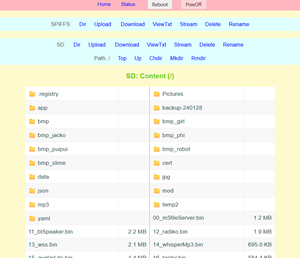
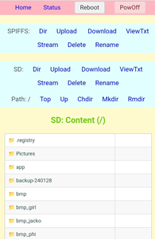

# m5stack-file-server

**[` 日本語 `](README_jp.md)**

## 1. Overview

`m5stack-file-server` is software that transforms an M5Stack device (ESP32-based) into a **Web File Server** operating on a WiFi network. You can easily manage files on the SD card or internal SPIFFS through a web browser.

**Main Purpose:**

*   Provide a means to access and manage files on the M5Stack from a PC or smartphone.
*   Facilitate checking configuration files, log files, images, audio, and updating programs.
*   Provide functionality that can be easily integrated into other software.
    (Feel free to incorporate it into your projects.)

**Supported Devices:**

*   ESP32-based M5Stack devices with an SD card slot, such as M5Stack Core2, CoreS3,CardPuter.
    *   (An SD card slot is not required if only using SPIFFS).

*   Currently confirmed to work on `Core2 for AWS` `CoreS3 SE` and  `CardPuter`. Please contact me if you encounter issues with other devices.

---

**PC and Smartphone Screen Display (Responsive Design):**


 [PC Screen](images/gazo01.png)

[Smartphone Screen](images/gazo02.jpg)

---

## 2. Key Features

*   **File System Access:**
    *   SD Card (if `SD_USE = true`)
    *   SPIFFS (Internal flash memory file system, if `SPIFFS_USE = true`)
*   **Web Interface (Responsive Design):**
    *   **File/Directory Listing:**
        *   SD Card: Displays the contents (files and subdirectories) of the current directory.
        *   SPIFFS: Displays the list of files in the root directory.
        *   Shows filename and size.
    *   **File Operations:**
        *   Upload: Transfer files from PC/smartphone to M5Stack.
        *   Download: Save files from M5Stack to PC/smartphone.
        *   Stream: Display images, audio, text, etc., directly in the browser.
        *   Delete: Select files to delete (with confirmation).
        *   Rename: Select a filename to change it.
        *   View Text: Display text files like `.txt`, `.log`, `.html` in the browser.
    *   **SD Card Directory Operations:**
        *   Change Directory (Navigate into subdirectories).
        *   Make Directory.
        *   Remove Directory (Only if empty, with confirmation).
        *   Go to Parent/Root Directory.
*   **Networking Features:**
    *   **WiFi Connection:** Connects to a WiFi access point using the specified SSID and password (STA mode).
    *   **mDNS:** Allows access via `http://(your_server_name)/` or `http://(your_server_name).local/`.
    *   **Configuration File:** Network settings in `main.cpp` can be overridden by placing a `wifi.txt` file in the root of the SD card/SPIFFS.
*   **System Information Display (`/system`):**
    *   File System Usage (SD/SPIFFS).
    *   Memory Usage (SRAM/PSRAM).
    *   NVS Information.
    *   CPU Information.
    *   Network Information (IP address, MAC address, etc.).
    *   Time Information (RTC/NTP).
    *   File Transfer Statistics.
*   **Web API:**
    *   `/shutdown?reboot=on`: Reboot the device.
    *   `/shutdown`: Shut down (power off) the device.
*   **Other Features:**
    *   **NTP Time Synchronization:** Retrieves time from an NTP server at startup and adjusts the RTC (if `RTC_ADJUST_ON = true`).
    *   **SD Card Updater:** (Optional) Firmware update functionality from the SD card.
    *   **Display Output:** (Optional) Shows IP address, etc., on the M5Stack screen.
    *   **Favicon/Home Image:** Displays `favicon.ico` / `homeImg.gif` if present in the root directory.

## 3. File Structure (Main Files)

*   **`main.cpp`**: Application entry point. Global settings, initialization calls, main loop.
*   **`fileServer/fileServer.cpp`**: Basic web server setup, common HTML generation, handlers for homepage (`/`) and system info page (`/system`).
*   **`fileServer/fs_util.cpp`**: Utility functions for WiFi connection, mDNS, NTP time sync, configuration file reading, etc.
*   **`fileServer/SD_handler.cpp`**: Web interface and file/directory operation handling for the SD card.
*   **`fileServer/SPIFFS_handler.cpp`**: Web interface and file operation handling for SPIFFS.
*   **`fileServer/webApi.cpp`**: Handling for Web API endpoints like `/shutdown`.
*   **`fileServer/fileServer.h`**: Shared definitions, declarations, and includes for the entire project.

## 4. Setup and Usage

1.  **Build and Flash, Bin File Provision:**
    *   Open the project in a development environment like PlatformIO, set the target device, build, and flash it to your M5Stack.
        Device environments for `m5stack-core2`, `m5stack-core2-sdu`, `m5stack-cores3` are provided. If using other device types, please add them to `platformio.ini` accordingly.
    *   **Bin File Provision:**
        *   The SD_Updater compatible Bin file created with `m5stack-core2-sdu` is provided at `BinsPack`.
          `00_m5fileServer.bin`

2.  **Network Configuration:**
    *   **Method 1 (Recommended):** Create a file named `wifi.txt` in the root directory of the SD card or SPIFFS with the following format:
        ```
        your_wifi_ssid
        your_wifi_ssid_password
        your_server_name
        ```
        (Ensure each line ends with a newline. `your_server_name` is the name used for mDNS.)
    *   **Method 2:** Directly edit the values of `YOUR_SSID`, `YOUR_SSID_PASS`, and `YOUR_SERVER_NAME` in `main.cpp`.
3.  **Access:**
    *   Power on the M5Stack. It will connect to WiFi, and the IP address and server name will be displayed on the Serial Monitor (and the screen if enabled).
    *   Open a web browser on a PC or smartphone connected to the same network and navigate to the displayed IP address (`http://<IP_address>/`) or the mDNS name (`http://<server_name>/` or `http://<server_name>.local/`).
4.  **Operation:**
    *   Use the menus and buttons on the displayed web interface to perform file operations and view system information.

## 5. Customization

*   **Enable/Disable Features:** Modify the constants `SD_USE`, `SPIFFS_USE`, `DISP_ON`, `RTC_ADJUST_ON`, etc., in `main.cpp` as needed.

    ```cpp
    // main.cpp
    const bool SD_USE = true;     // Set to true to use SD card
    const bool SPIFFS_USE = true; // Set to true to use SPIFFS
    bool DISP_ON = true;          // Set to true to display messages on the screen
    bool RTC_ADJUST_ON = true;    // Set to true for automatic RTC adjustment
    ```

*   **Network Settings:** Change the `wifi.txt` file or the default values in `main.cpp` as described above.
*   **Appearance:**
    *   Place a `favicon.ico` file in the root of the SD card or SPIFFS to change the browser tab icon.
    *   Place a `homeImg.gif` file in the root of the SD card or SPIFFS to display an image on the homepage.
        *   Samples of `favicon.ico` and `homeImg.gif` are available in the `CopyToSD_or_SPIFFS` folder on GitHub. Please copy and use them.

## 6. LICENSE

[MIT LICENSE](LICENSE)

*   Author: NoRi

<br>

*   The included `homeImg.gif` and `favicon.ico` use illustrations from Stack-chan public materials.
    -   [Okimoku-san's Public Materials Wiki](https://okimoku.com/wiki/%E3%82%A4%E3%83%A9%E3%82%B9%E3%83%88)<br>
        Thanks to the creators who allowed the use of their images and to "Okimoku-san" for compiling the public materials.
    *   [Stack-chan](https://github.com/meganetaaan) is an open-source project published by Shishikawa-san.

## 7. Links

*   Github: https://github.com/NoRi-230401/m5stack-file-server
*   BINS for M5Core2: https://github.com/NoRi-230401/BinsPack-for-StackChan-Core2
*   SD-Updater: https://github.com/tobozo/M5Stack-SD-Updater

---
